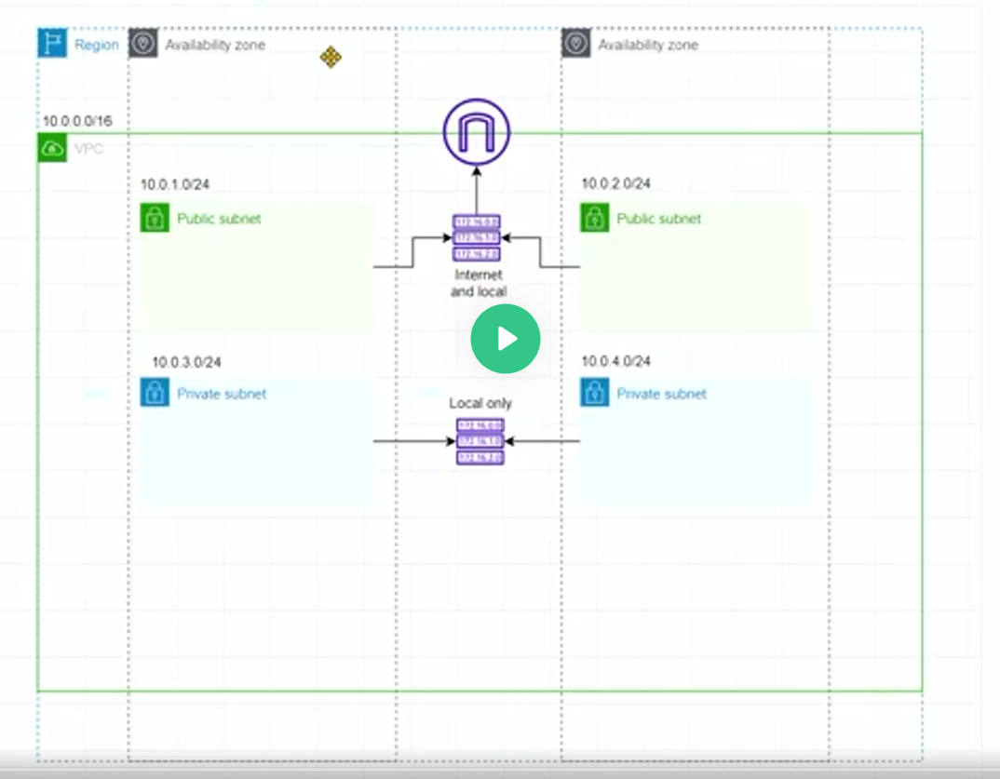
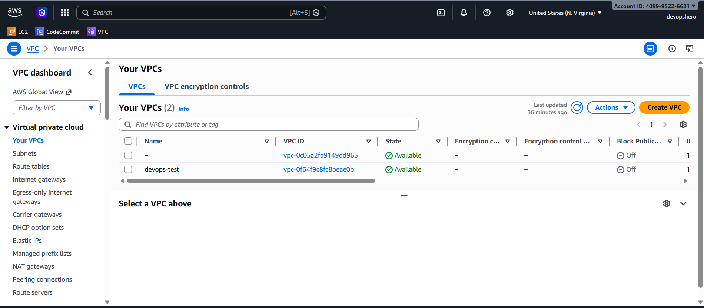
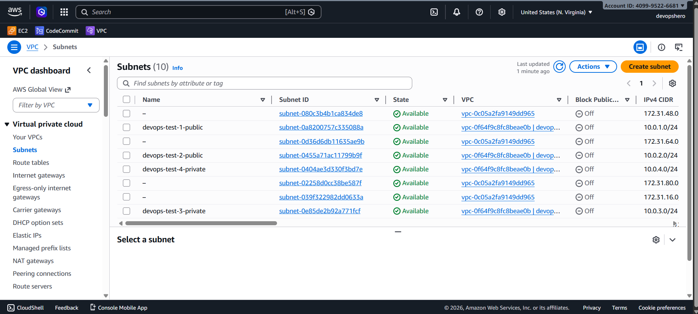
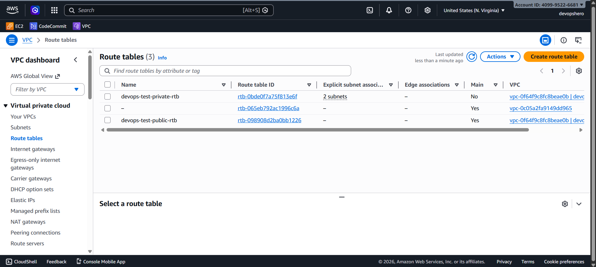
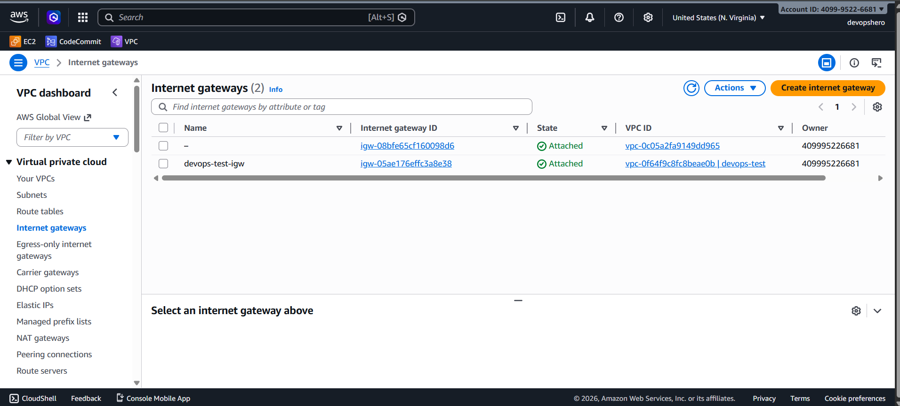

# AWS VPC Architecture

This project presents a visual breakdown of a typical AWS VPC architecture and its core networking building blocks.

## Project Overview

The diagrams in this repository help explain how network components are organized and connected inside AWS:

- VPC layout
- Subnet segmentation
- Route table behavior
- Internet gateway connectivity
- End-to-end architecture view

## Architecture Diagrams

### 1) Full Architecture

This diagram provides a complete view of the VPC design and how all networking resources relate to each other.

### 2) VPCs

This diagram highlights VPC boundaries and high-level network isolation.

### 3) Subnets

This diagram shows subnet structure, usually including public/private segmentation across availability zones.

### 4) Route Tables

This diagram demonstrates routing behavior between subnets and external destinations.

### 5) Internet Gateways

This diagram explains how internet access is enabled through internet gateways.

## Repository Contents

- `project-arch.png` - Full architecture diagram
- `vpcs.png` - VPC-focused view
- `subnets.png` - Subnet-focused view
- `route-tables.png` - Route table-focused view
- `internet-gateways.png` - Internet gateway-focused view

## Usage

Open this repository in your editor or GitHub to view the diagrams and use them as reference material for AWS networking discussions, documentation, or learning.
